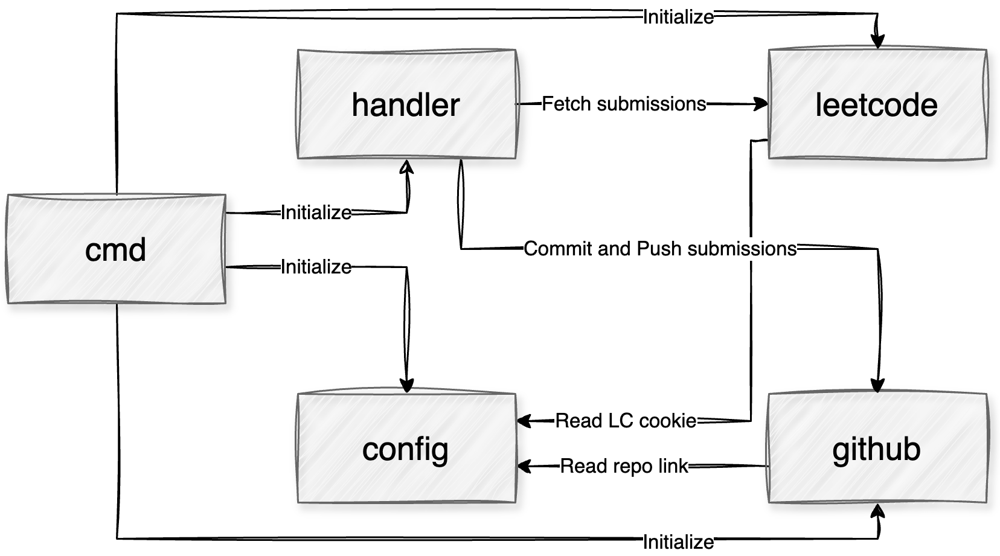
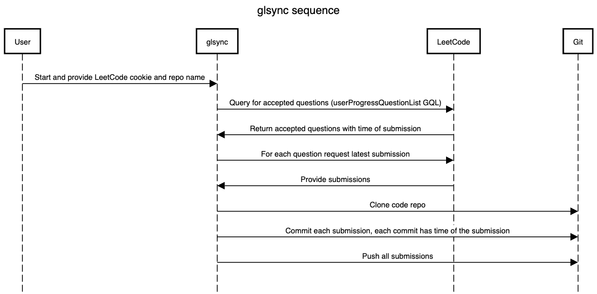
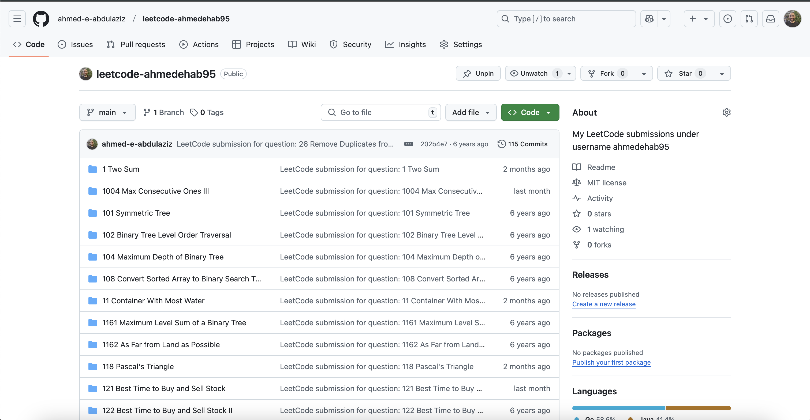

<p align="center">
  
</p>

# glsync

CLI tool to sync all your LeetCode submissions to Github (And possibly any other git client)

## Requirements

- Git
- Go 1.23.3 or later to build or install
- Make to use the Makefile

## Introduction

This tool makes it easy to take all the code you previously submitted to LeetCode and submit it to Github or any other git client.

I created it because companies judge interviewees by how frequently they commit to Github. This can make time spent in LeetCode feel wasted, as it won't be visible on your GitHub profile.

Some tools do something similar but require submitting each question independently, which is useless if you want your previous commits.
I found another tool that commits all your code but doesn't respect the submission timestamp. So, your GitHub profile will look weird with all your LeetCode submitted simultaneously. That also doesn't showcase your journey with LeetCode or how you improved the type of questions you are solving.

So now, with one single command, you can transfer all of your LeetCode submissions to GitHub, and each commit will use the LeetCode's submission timestamp/

## Installation

Do one of the following:

- Download the released binaries on the GitHub repo and use them directly after renaming it to `glsync`
- Clone the repo and run `make install`, make sure that your $PATH contains your $GOPATH, such as the following snippet

```sh
export GOPATH=$HOME/go #Don't do if GOPATH is already set
export PATH=$PATH:$GOROOT/bin:$GOPATH/bin
```

## LeetCode Cookie

You need LeetCode's session cookie to access the GraphQL endpoints and get the code submissions.

You can get the cookie by doing the following:

1. Log in to <https://leetcode.com>. Log out first if you are already logged in as we need a fresh login
2. Open developer tools or console. Here is how to do it in Chrome <https://developer.chrome.com/docs/devtools/open>
3. Navigate to the **Application** tab
4. Select **Cookies** in the left panel
5. Copy the value for **LEETCODE_SESSION**

## Usage

Run the following

```sh
glsync -lc-cookie="$YOUR_LEETCODE_COOKIE_GOES_HERE" -repo-url="$YOUR_GITHUB_REPO_URL_GOES_HERE"
```

It will keep printing each time it commits, showing the progress, and exiting when it finishes.

## How it works

It does the following:

1. Fetch from LeetCode your submissions using their GraphQL endpoint using the following queries:
   1. `userProgressQuestionList` to get the questions you answered with the timestamp.
   2. `submissionList` to get the submission ID and code language.
   3. `submissionDetails` to get the last submission code.

2. Clone the target code's Git repo.
3. For each LeetCode submission, commit using its timestamp.
4. Push the commits to Git and delete the local cloned repo.

### High-Level Diagram

High-level diagram to show how glsync components interact with each other



### Sequence Diagram

Sequence Diagram showing how glsync works



## Result



This is an example of me running glsync against my LeetCode account, you can see the commit dates aren't the same as it respects the dates I did the commits on and it has all the questions I solved on LeetCode. You can see this repo [here](https://github.com/ahmed-e-abdulaziz/leetcode-ahmedehab95)

## Notes

I did this in about a week, so if you want more features or to support other platforms, or if you encounter bugs, feel free to reach out to me at <ahmed.ehab5010@gmail.com>
