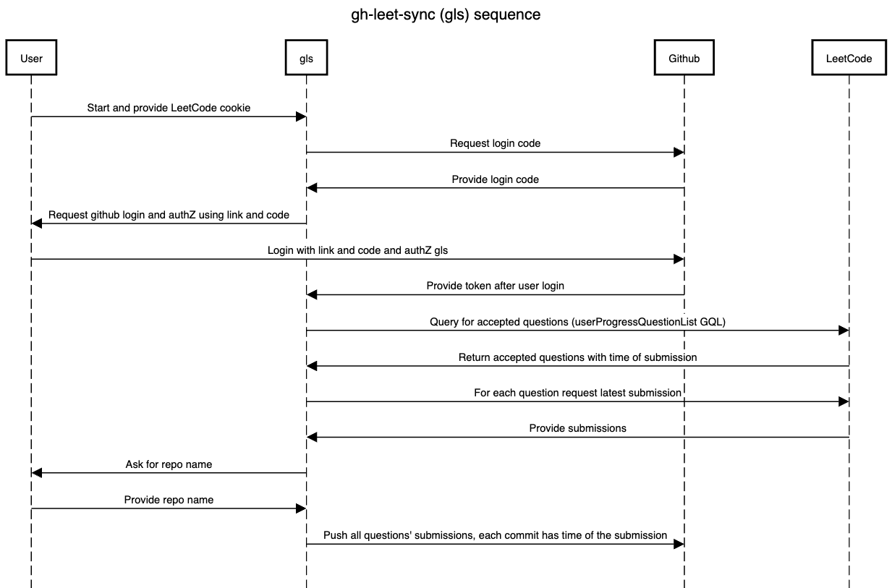

# gh-leet-sync

CLI tool to sync all your LeetCode submissions to Github (And possibly any other git client)

## Requirements

- Git
- Go 1.23.3 or later to build or install
- Make to use the Makefile

## Introduction

This tool makes it easy to take all of the code you previously submitted to LeetCode and submit it to Github or any other git client

I created it because companies keep judging interviewees by how frequent their commits are to Github, which makes the time spent in LeetCode can be feel like wasted time as it won't be visible on your Github profile.

There was some tools that does something similar but has to submit each question independently which is not useful if you want your previous commits.
I found another tools that commits all your code but it doesn't respect the submission timestamp. So your gihub profile will look weird with all of your LeetCode submitted in the same moment. And that also doesn't showcase your journey with LeetCode or how you were improving in the type of questions and so on.

So now with one single command you can transfer all of your LeetCode submissions to Github and each commit will use the LeetCode's submission timestamp/

## Installation

### Two Options

- Download the released binaries on the github repo and use them directly after renaming it to `glsync`
- Clone the repo and run `make install`

## Usage

Run the following

```sh
glsync -lc-cookie="$YOUR_LEETCODE_COOKIE_GOES_HERE" -repo-url="$YOUR_GITHUB_REPO_URL_GOES_HERE"
```

It will keep printing each time it commits showing the progress and it will exit when it finishes

## How it works

It does the following:

1. Fetch from LeetCode your submissions using their GraphQL endpoint using the following queries:
   1. `userProgressQuestionList` to get the questions you answered with timestamp.
   2. `submissionList` to get the submission id and code language.
   3. `submissionDetails` to get the last submission code.

2. Clone the target code's Git repo.
3. For each LeetCode submission do a commit using its timestamp.
4. Push the commits to Git and delete the local cloned repo.

### High Level Diagram

High Level Diagram to show how glsync components interacts with each other


### Sequence Diagram

Sequence Diagram showing how glsync works



## Notes

I did this in like a week so if you want more features or to support other platforms or if you encounter bugs feel free to reach to me at <ahmed.ehab5010@gmail.com>
