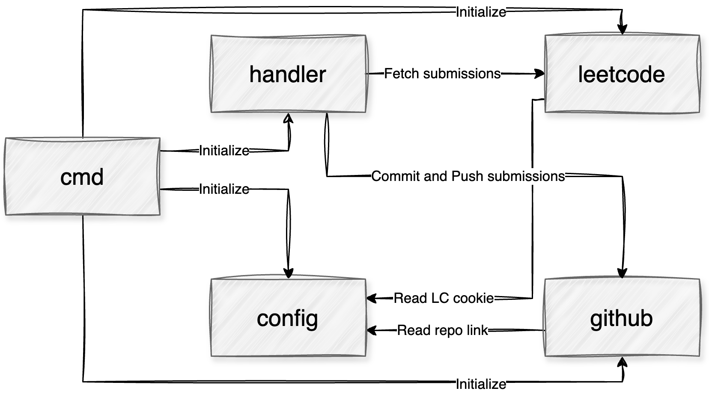
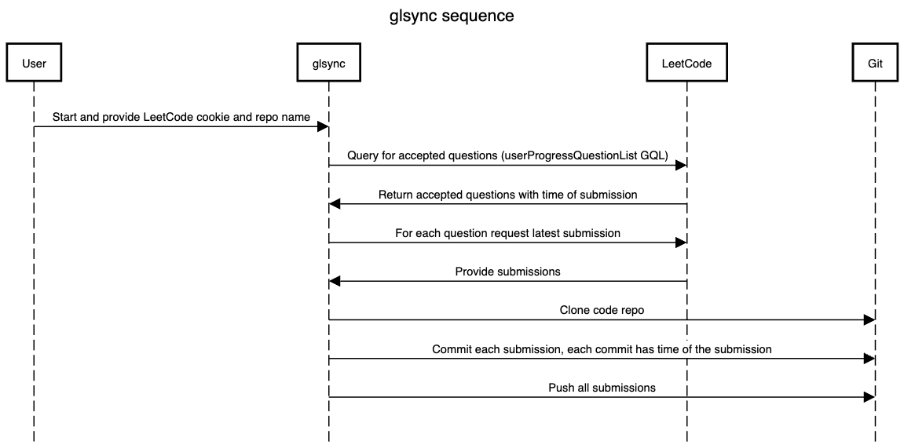
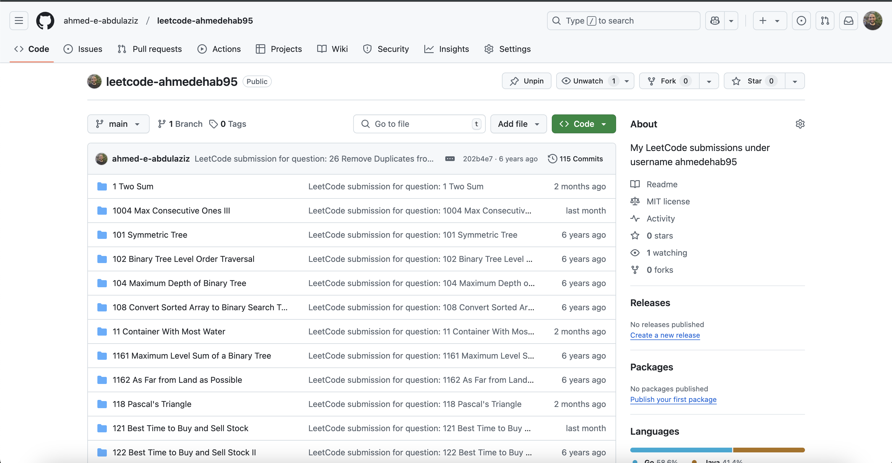

<p align="center">
  
</p>

- [glsync](#glsync)
  - [Requirements](#requirements)
  - [Introduction](#introduction)
  - [Leaderboard](#leaderboard)
  - [Installation](#installation)
  - [LeetCode Cookie](#leetcode-cookie)
  - [Usage](#usage)
  - [Demo](#demo)
  - [How it works](#how-it-works)
    - [High-Level Diagram](#high-level-diagram)
    - [Sequence Diagram](#sequence-diagram)
  - [Result](#result)
  - [Notes](#notes)

# glsync

CLI tool to sync all your LeetCode submissions to Github (And possibly any other git client)
  
## Requirements

- Git
- Empty repo on GitHub to push your submissions to
- Go 1.23.3 or later to build or install
- Make to use the Makefile

## Introduction

This tool makes it easy to take all the code you previously submitted to LeetCode and submit it to Github or any other git client.

I created it because companies judge interviewees by how frequently they commit to Github. This can make time spent in LeetCode feel wasted, as it won't be visible on your GitHub profile.

Some tools do something similar but require submitting each question independently, which is useless if you want your previous commits.
I found another tool that commits all your code but doesn't respect the submission timestamp. So, your GitHub profile will look weird with all your LeetCode submitted simultaneously. That also doesn't showcase your journey with LeetCode or how you improved the type of questions you are solving.

So now, with one single command, you can transfer all of your LeetCode submissions to GitHub, and each commit will use the LeetCode's submission timestamp

## Leaderboard

A leadboard of the largest repos created by glsync, contact me or raise an issue to add your repo here as well or if the count is not up to date.

| Rank  | Repo                                                      | Solutions Count | Language |
| ----- | --------------------------------------------------------- | --------------- | -------- |
| 1  🌟 | https://github.com/segorucu/Leetcode                      | 1058            | Python   |
| 2     | https://github.com/Fabiobreo/leetcode-fabiobrea           | 265             | C#       |
| 3     | https://github.com/llEraserheadll/LeetcodeSol             | 189             | Python   |
| 4     | https://github.com/ahmed-e-abdulaziz/leetcode-ahmedehab95 | 116             | Go, Java |

## Installation

Do one of the following:

- Download the released binaries on the GitHub repo and use them directly after renaming it to `glsync`
- Clone the repo and run `make install`, make sure that your $PATH contains your $GOPATH, such as the following snippet

```sh
export GOPATH=$HOME/go #Don't do if GOPATH is already set
export PATH=$PATH:$GOROOT/bin:$GOPATH/bin
```

## LeetCode Cookie

You need LeetCode's session cookie to access the GraphQL endpoints and get the code submissions.

You can get the cookie by doing the following:

1. Log in to <https://leetcode.com>. Log out first if you are already logged in as we need a fresh login
2. Open developer tools or console. Here is how to do it in Chrome <https://developer.chrome.com/docs/devtools/open>
3. Navigate to the **Application** tab
4. Select **Cookies** in the left panel
5. Copy the value for **LEETCODE_SESSION**

## Usage

Run the following

```sh
glsync -lc-cookie="$YOUR_LEETCODE_COOKIE_GOES_HERE" -repo-url="$YOUR_GITHUB_REPO_URL_GOES_HERE"
```

It will keep printing each time it commits, showing the progress, and exiting when it finishes.

## Demo


You can find the demo video in this repo at `docs/glsync-full-demo.mp4`

## How it works

It does the following:

1. Fetch from LeetCode your submissions using their GraphQL endpoint using the following queries:
   1. `userProgressQuestionList` to get the questions you answered with the timestamp.
   2. `submissionList` to get the submission ID and code language.
   3. `submissionDetails` to get the last submission code.

2. Clone the target code's Git repo.
3. For each LeetCode submission, commit using its timestamp.
4. Push the commits to Git and delete the local cloned repo.

### High-Level Diagram

High-level diagram to show how glsync components interact with each other



### Sequence Diagram

Sequence Diagram showing how glsync works



## Result



This is an example of me running glsync against my LeetCode account, you can see the commit dates aren't the same as it respects the dates I did the commits on and it has all the questions I solved on LeetCode. You can see this repo [here](https://github.com/ahmed-e-abdulaziz/leetcode-ahmedehab95)

## Notes

I did this in about a week, so if you want more features or to support other platforms, or if you encounter bugs, feel free to reach out to me at <ahmed.ehab5010@gmail.com>

---

## leetcode.cn Support (Chinese LeetCode)

> This section covers syncing from **leetcode.cn** (LeetCode China), the version
> used by Chinese programmers on the mainland. The original tool only supports
> leetcode.com. All existing `leetcode.com` behaviour is unchanged.

### Why This Exists

Chinese programmers spend significant time solving problems on leetcode.cn, but
their work is invisible on GitHub because leetcode.cn and leetcode.com are
completely separate platforms with separate accounts. This modification lets
Chinese users transfer all their leetcode.cn submissions to GitHub with the
correct original timestamps, so their LeetCode journey is visible on their
GitHub contribution graph just like any other developer.

### Additional Requirements for leetcode.cn

leetcode.cn uses Cloudflare Bot Management on top of its own session
authentication, so three cookies are required instead of one:

| Flag | Cookie name | Purpose |
|---|---|---|
| `-lc-cookie` | `LEETCODE_SESSION` | Your LeetCode session (same as `.com`) |
| `-lc-csrf-token` | `csrftoken` | Django CSRF protection required by leetcode.cn |
| `-lc-cf-clearance` | `cf_clearance` | Cloudflare bot challenge clearance |

### How to Get the Cookies

All three values come from your browser after logging in to leetcode.cn.

1. Open **Chrome** (or any Chromium-based browser) and go to <https://leetcode.cn>
2. Log in with your account
3. Open **Developer Tools**: press `F12` or right-click anywhere and choose **Inspect**
4. Go to the **Application** tab
5. In the left panel expand **Cookies** and click `https://leetcode.cn`
6. Copy the values for the three cookies below:

| Cookie name | Typical appearance |
|---|---|
| `LEETCODE_SESSION` | Long JWT string starting with `eyJ...` |
| `csrftoken` | 32-character alphanumeric string |
| `cf_clearance` | Long hash string |

> **Cookie expiry:** `cf_clearance` is tied to your browser session and IP
> address. It expires after roughly 30 minutes of inactivity or when Cloudflare
> re-challenges your browser. If the tool returns HTTP 403 errors, visit
> leetcode.cn in Chrome, wait for the page to fully load, and copy a fresh
> `cf_clearance` value before re-running. `LEETCODE_SESSION` and `csrftoken`
> last much longer (several weeks).

### Usage

```sh
glsync \
  -site=cn \
  -lc-cookie="YOUR_LEETCODE_SESSION" \
  -lc-csrf-token="YOUR_CSRFTOKEN" \
  -lc-cf-clearance="YOUR_CF_CLEARANCE" \
  -repo-url="https://github.com/YOUR_USERNAME/YOUR_REPO.git"
```

The `-site=cn` flag switches all API endpoints and cookie domains to
`leetcode.cn`. Omitting it (or setting `-site=com`) uses `leetcode.com` as
before.

### Expected Run Time

leetcode.cn enforces a rate limit of approximately **60 requests per 10-minute
sliding window** on its submission detail API. The tool automatically paces
requests at one per ~10 seconds (9s sleep + ~1s network round-trip) to stay
under this limit without wasting extra time.

| Questions solved | Approximate run time |
|---|---|
| 100 | ~17 minutes |
| 300 | ~50 minutes |
| 560 | ~95 minutes |

The tool prints progress for each question. Do not close the terminal while it
is running — it pushes to GitHub only **after all submissions are fetched and
committed locally**. Killing it mid-run leaves your GitHub repo unchanged.

### Troubleshooting

**`Rate limit hit, retry 1/25 after 520s`**

You exceeded 60 requests within a 10-minute window, usually from running the
tool multiple times in quick succession. The tool automatically waits ~9 minutes
and retries. Leave it running; it will recover on its own without any
intervention.

**`unexpected non-JSON response (HTTP 403) ... Just a moment...`**

Cloudflare re-issued a browser challenge. Visit <https://leetcode.cn> in Chrome,
wait for the page to fully load (the spinner disappears), then copy a fresh
`cf_clearance` cookie and re-run with the updated value.

**`no submissions found for question: <slug>`**

leetcode.cn returned an empty submission list for this question. This can happen
for very recently added problems or contest problems with restricted access. The
tool skips the question with a warning and continues with the rest.

**Push fails with authentication error**

Make sure your `-repo-url` uses HTTPS and that you have a GitHub personal access
token configured in your Git credential store (`gh auth login` is the easiest
way), or use an SSH URL (`git@github.com:user/repo.git`) instead.

---

If you run into issues specific to leetcode.cn — API schema changes, Cloudflare
challenges, or rate limit behaviour — feel free to open an issue or reach out to
the contributor who added CN support at <weijie.zhu526@gmail.com>.
